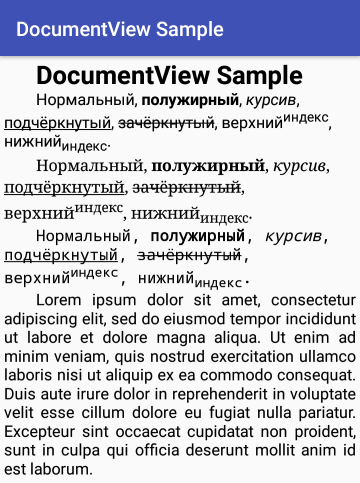

# DocumentView

DocumentView это Kotlin-виджет для Android для вывода отформатированного текста. Аналог [TextView](https://developer.android.com/reference/android/widget/TextView) из Android SDK с его [Spannable](https://developer.android.com/reference/android/text/Spannable), но с более широкими (в планах!) возможностями в части форматирования текста.

Изначально DocumentView создавался для вывода HTML. Для моих задач обычный TextView с его [fromHtml()](https://developer.android.com/reference/android/text/Html.html#fromHtml(java.lang.String,%20int)) оказался недостаточным. Во-первых, не доставало растягивания по ширине (justification появился в API 26, а я ориентировался на API 15). Во-вторых, мягкие переносы работают не так, как я ожидал. В-третьих, HTML-код в моём головном проекте поставляется пользователем, и мне, с одной стороны, хотелось полностью контролировать, что будет в этом HTML, ограничивая пользователя от лишнего, а с другой стороны, наоборот, хотелось добавить возможности (дополнительные теги и аттрибуты), которых нет в обычном HTML.

Первый проект [Html2Spannable](https://github.com/vi-k/android-html2spannable) свёлся к тому, что я сам парсил HTML и затем формировал из него [Spannable](https://developer.android.com/reference/android/text/SpannableStringBuilder). Столкнувшись с некоторыми ограничениями, решил сделать свой собственный отдельный ~велосипед~ класс [Document], хранящий в себе форматированный документ. Причём сделать его не зависящим ни от Android SDK (прогнозируемая многоплатформенность Kotlin заставляет думать наперёд), ни от HTML. Парсинг HTML отдан отдельному модулю [Html]. Преобразование результата парсинга в [Document] осуществляется модулем [HtmlDocument].

Работа только начата. Пока доступно только самое простое форматирование текста, но уже есть выравнивание по ширине (justification) и обработка мягких переносов.

## Самый простой пример использования

Layout:
```xml
<ru.vik.documentview.DocumentView
    android:id="@+id/docView"
    android:layout_width="match_parent"
    android:layout_height="wrap_content" />
```

MainActivity.kt:
```kotlin
override fun onCreate(savedInstanceState: Bundle?) {
    super.onCreate(savedInstanceState)
    setContentView(R.layout.activity_main)

    val docView: DocumentView = findViewById(R.id.docView)

    val fontList = FontList()
    fontList.createFamily("sans_serif", Font(Typeface.SANS_SERIF))
    fontList.createFamily("serif", Font(Typeface.SERIF))
    fontList.createFamily("mono", Font(Typeface.MONOSPACE))

    docView.fontList = fontList

    docView.characterStyle.font = "sans_serif"
    docView.characterStyle.size = Size.dp(16f)
    docView.paragraphStyle.firstLeftIndent = Size.dp(32f)

    val document = SimpleHtmlDocument()
    docView.document = document

    document.blockStyle.setPadding(Size.dp(4f))

    val testString = "Нормальный, <b>полужирный</b>, <i>курсив</i>, <u>подчёркнутый</u>, <s>зачёркнутый</s>, верхний<sup>индекс</sup>, нижний<sub>индекс</sub>."
    val testString2 = "Lorem ipsum dolor sit amet, consectetur adipiscing elit, sed do eiusmod tempor incididunt ut labore et dolore magna aliqua. Ut enim ad minim veniam, quis nostrud exercitation ullamco laboris nisi ut aliquip ex ea commodo consequat. Duis aute irure dolor in reprehenderit in voluptate velit esse cillum dolore eu fugiat nulla pariatur. Excepteur sint occaecat cupidatat non proident, sunt in culpa qui officia deserunt mollit anim id est laborum."

    document.setText("<h1>DocumentView Sample</h1>\n" +
            "<p>$testString</p>\n" +
            "<p font='serif'>$testString</p>\n" +
            "<p font='mono'>$testString</p>\n" +
            "<p align='justify'>$testString2</p>")
}
```

Результат:



Что мы здесь делаем:

Сначала находим наш виджет:
```kotlin
val docView: DocumentView = findViewById(R.id.docView)
```

Создаём шрифты, которые будем использовать:
```kotlin
val fontList = FontList()
fontList.createFamily("sans_serif", Font(Typeface.SANS_SERIF))
fontList.createFamily("serif", Font(Typeface.SERIF))
fontList.createFamily("mono", Font(Typeface.MONOSPACE))
docView.fontList = fontList
```

Функция `createFamily()` создаёт сразу 4 шрифта для разных начертаний: нормального, **полужирного**, *курсива* и ***полужирного вместе с курсивом***. Это имеет смысл только для встроенных шрифтов. Для пользовательских шрифтов все файлы с начертаниями необходимо загрузить отдельно. Как это сделать, смотрите в [документации](https://github.com/vi-k/android-documentview/wiki/Установка шрифтов). Если шрифт не имеет отдельных файлов для отдельных начертаний, то ничего загружать не надо, полужирный и курсив будут создаваться автоматически при выводе.

Настраиваем параметры по-умолчанию:
```kotlin
docView.characterStyle.font = "sans_serif"
docView.characterStyle.size = Size.dp(16f)
docView.paragraphStyle.firstLeftIndent = Size.dp(32f)
```

Устанавливаем шрифт по-умолчанию, базовый размер шрифта и отступ для первой строки. Стили characterStyle и paragraphStyle описаны в документации к [Document].

Создаём объект класса [Document], отвечающий за форматирование документа. В данном случае используем уже готовый класс преобразователь из HTML в [Document].
```kotlin
val document = SimpleHtmlDocument()
docView.document = document
```

[DocumentView] не связан напрямую с HTML. Поэтому в этом месте может оказаться и какой-нибудь другой класс-преобразователь. Например, (в каком-нибудь будущем) PlainTextDocument и MarkdownDocument.

Устанавливаем отступы от краёв:
```kotlin
document.blockStyle.setPadding(Size.dp(4f))
```

Отступы можно сделать и обычным способом через свойства View `paddingLeft`, `paddingTop` и т.п., но с той разницей, что в этом случае значение будет указываться в пикселях устройства, в то время как blockStyle принимает значение в пикселях, не зависящих от устройства (device-independent pixels). Также можно указать значение, пропорциональное или размеру шрифта (`Size.em()`) или ширине виджета (`Size.percent()` или `Size.ratio()`).

Подробное описание возможностей классов смотрите в документации:
1) [DocumentView].
2) [Document].
3) [Html].
4) [HtmlDocument].

[DocumentView]:https://github.com/vi-k/android-documentview/wiki
[Document]:https://github.com/vi-k/kotlin-utils/wiki/document
[Html]:https://github.com/vi-k/kotlin-utils/wiki/html
[HtmlDocument]:https://github.com/vi-k/kotlin-utils/wiki/htmldocument
