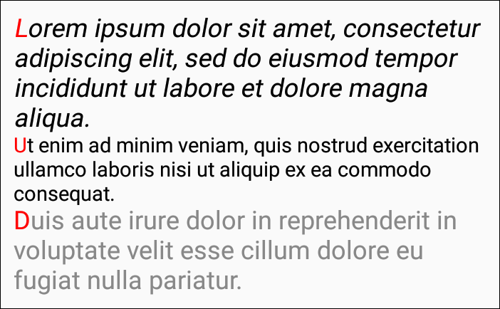

# DocumentView

DocumentView это Kotlin-виджет для Android для вывода отформатированного текста. Аналог [TextView](https://developer.android.com/reference/android/widget/TextView) из Android SDK с его [Spannable](https://developer.android.com/reference/android/text/Spannable), но с более широкими (в планах!) возможностями в части форматирования текста.

Работа только начата. Пока доступно только самое простое форматирование текста, но уже есть выравнивание по ширине (justification) и обработка мягких переносов.

## Содержание
- [Простой пример](#Простой-пример)
- [Абзацы](#Абзацы)
- [Шрифты](#Шрифты)
- [Рамки](#Рамки)

## Простой пример

Layout:

```xml
<ru.vik.documentview.DocumentView
    android:id="@+id/docView"
    android:layout_width="match_parent"
    android:layout_height="wrap_content" />
```

MainActivity.kt:

```kotlin
override fun onCreate(savedInstanceState: Bundle?) {
    super.onCreate(savedInstanceState)
    setContentView(R.layout.activity_main)

    val docView: DocumentView = findViewById(R.id.docView)

    docView.document.setText("Lorem ipsum dolor sit amet, consectetur adipiscing elit, sed do eiusmod ...")
    docView.document
            .addSpan(CharacterStyle(color = Color.RED), 0, 5)
            .addSpan(CharacterStyle(bold = true), 6, 11)
            .addSpan(CharacterStyle(italic = true), 12, 17)
            .addSpan(CharacterStyle(bold = true, italic = true), 18, 21)
            .addSpan(CharacterStyle(underline = true), 22, 26)
            .addSpan(CharacterStyle(strike = true), 28, 39)
            .addSpan(CharacterStyle(baselineShift = Size.em(-0.4f), size = Size.em(0.85f)), 50, 55)
            .addSpan(CharacterStyle(baselineShift = Size.em(0.25f), size = Size.em(0.85f)), 60, 63)
            .addSpan(CharacterStyle(scaleX = 0.6f), 64, 71)
}
```


Виджет содержит внутри себя объект платформонезависимого класса `[Document]`, который хранит в себе форматируемый документ. С ним мы и работаем, добавляя участки форматирования. Класс Span хранит в себе стиль знаков, начало и конец форматирования.

Участки могут пересекаться. В этом случае они либо дополняют друг друга, либо последний перекрывает первый:

```kotlin
docView.document.setText("Lorem ipsum dolor sit amet ...")
docView.document
        .addSpan(CharacterStyle(bold = true), 0, 17)
        .addSpan(CharacterStyle(italic = true), 12, 26)
```


```kotlin
docView.document
        .addSpan(CharacterStyle(color = Color.RED), 0, 17)
        .addSpan(CharacterStyle(color = Color.GREEN), 12, 41)
```


## Абзацы

В предыдущих примерах был только один абзац. Если же абзацев несколько, то доступ к каждому осуществляется по индексу:

```kotlin
docView.document.setText("Lorem ipsum dolor sit amet, consectetur adipiscing elit, sed " +
        "do eiusmod tempor incididunt ut labore et dolore magna aliqua.\n" +
        "Ut enim ad minim veniam, quis nostrud exercitation ullamco laboris nisi ut " +
        "aliquip ex ea commodo consequat. Duis aute irure dolor in reprehenderit " +
        "in voluptate velit esse cillum dolore eu fugiat nulla pariatur.\n" +
        "Excepteur sint occaecat cupidatat non proident, sunt in culpa qui officia " +
        "deserunt mollit anim id est laborum.")
docView.document[0]
        .addSpan(CharacterStyle(color = Color.RED), 0, 1)
docView.document[1]
        .addSpan(CharacterStyle(color = Color.RED), 0, 1)
docView.document[2]
        .addSpan(CharacterStyle(color = Color.RED), 0, 1)
```


У абзаца есть собственные настройки стиля знаков, изменение которого оказывает воздействие на весь абзац:

```kotlin
docView.document[0].characterStyle.italic = true
docView.document[1].characterStyle.size = Size.em(0.8f)
docView.document[2].characterStyle.color = Color.GRAY
```



Форматирование, добавленное через `addSpan()`, накладывается поверх общих настроек абзаца.

## Шрифты

Чтобы использовать другие шрифты, кроме стандартного, их надо создать и добавить в список `fontList`:

```kotlin
docView.fontList.createFamily("sans_serif", Font(Typeface.SANS_SERIF))
docView.fontList.createFamily("serif", Font(Typeface.SERIF))
docView.fontList.createFamily("mono", Font(Typeface.MONOSPACE))

docView.document[0].characterStyle.font = "sans_serif"
docView.document[1].characterStyle.font = "serif"
docView.document[2].characterStyle.font = "mono"
```


Функция `createFamily()` создаёт сразу 4 шрифта для разных начертаний: нормального, **полужирного**, *курсива* и ***полужирного вместе с курсивом***. Это возможно только для встроенных шрифтов. Для пользовательских шрифтов все файлы с начертаниями необходимо загрузить отдельно. Если этого не сделать, соответствующий шрифт будет при необходимости генерироваться автоматически. Но специально приготовленные шрифты могут существенно отличаться от генерируемых:

```kotlin
docView.document.setText("Lorem ipsum dolor sit amet ...\n" +
        "Lorem ipsum dolor sit amet ...")
docView.document[0]
        .addSpan(CharacterStyle(bold = true), 0, 17)
        .addSpan(CharacterStyle(italic = true), 12, 26)
docView.document[1]
        .addSpan(CharacterStyle(bold = true), 0, 17)
        .addSpan(CharacterStyle(italic = true), 12, 26)

docView.fontList.createFamily("serif1", Font(Typeface.SERIF))
docView.fontList["serif2"] = Font(Typeface.SERIF)

docView.document[0].characterStyle.font = "serif1"
docView.document[1].characterStyle.font = "serif2"
```


Чтобы DocumentView в нужные моменты мог задействовать нужные шрифты, при создании шрифта к основному названию надо добавить соответствующий постфикс: `:bold`, `:italic`, `:bold_italic`

```kotlin
docView.fontList["serif2:bold"] = Font(Typeface.create(Typeface.SERIF, Typeface.BOLD))
docView.fontList["serif2:italic"] = Font(Typeface.create(Typeface.SERIF, Typeface.ITALIC))
docView.fontList["serif2:bold_italic"] = Font(Typeface.create(Typeface.SERIF, Typeface.BOLD_ITALIC))
```


## Рамки

Настраиваем параметры по-умолчанию:
```kotlin
docView.characterStyle.font = "sans_serif"
docView.characterStyle.size = Size.dp(16f)
docView.paragraphStyle.firstLeftIndent = Size.dp(32f)
```

Устанавливаем шрифт по-умолчанию, базовый размер шрифта и отступ для первой строки. Стили characterStyle и paragraphStyle описаны в документации к [Document].

Создаём объект класса [Document], отвечающий за форматирование документа. В данном случае используем уже готовый класс преобразователь из HTML в [Document].
```kotlin
val document = SimpleHtmlDocument()
docView.document = document
```

[DocumentView] не связан напрямую с HTML. Поэтому в этом месте может оказаться и какой-нибудь другой класс-преобразователь. Например, (в каком-нибудь будущем) PlainTextDocument и MarkdownDocument.

Устанавливаем отступы от краёв:
```kotlin
document.blockStyle.setPadding(Size.dp(4f))
```

Отступы можно сделать и обычным способом через свойства View `paddingLeft`, `paddingTop` и т.п., но с той разницей, что в этом случае значение будет указываться в пикселях устройства, в то время как blockStyle принимает значение в пикселях, не зависящих от устройства (device-independent pixels). Также можно указать значение, пропорциональное или размеру шрифта (`Size.em()`) или ширине виджета (`Size.percent()` или `Size.ratio()`).

Подробное описание возможностей классов смотрите в документации:
1) [DocumentView].
2) [Document].
3) [Html].
4) [HtmlDocument].

[DocumentView]:https://github.com/vi-k/android-documentview/wiki
[Document]:https://github.com/vi-k/kotlin-utils/wiki/document
[Html]:https://github.com/vi-k/kotlin-utils/wiki/html
[HtmlDocument]:https://github.com/vi-k/kotlin-utils/wiki/htmldocument
