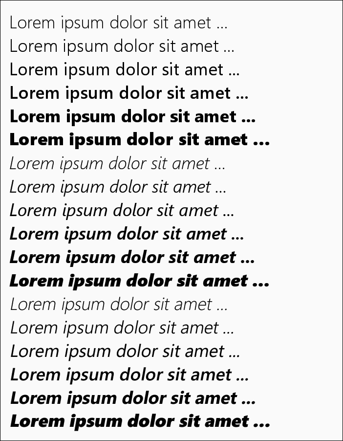

# DocumentView

`DocumentView` это Kotlin-виджет для Android для вывода отформатированного текста. Аналог `TextView` из Android SDK с его `Spannable`, но с более широкими (в планах!) возможностями в части форматирования текста.

Работа только начата. Пока доступно только самое простое форматирование текста, но уже есть выравнивание по ширине (justification) и обработка мягких переносов.

[document]:https://github.com/vi-k/kotlin-utils/wiki/document
[html]:https://github.com/vi-k/kotlin-utils/wiki/html
[htmldocument]:https://github.com/vi-k/kotlin-utils/wiki/htmldocument
[color]:https://github.com/vi-k/kotlin-utils/wiki/color

## Содержание
- [Простой пример](#Простой-пример)
- [Абзацы](#Абзацы)
- [Шрифты](#Шрифты)
- [Рамки](#Рамки)
- [Оформление абзацев](#Оформление-абзацев)
- [Коррекция шрифтов](#Коррекция-шрифтов)
- [Переносы слов](#Переносы-слов)
- [Базовые линии](#Базовые-линии)
    - [Смещение относительно базовой линии (`baselineShift`)](#Смещение-относительно-базовой-линии-baselineshift)
    - [Выравнивание по вертикали внутри строки (`verticalAlign`)](#Выравнивание-по-вертикали-внутри-строки-verticalalign)
    - [Интерлиньяж, или межстрочный интервал (`leading`)](#Интерлиньяж-или-межстрочный-интервал-leading)
    - [Синхронизация текстов по базовой линии](#Синхронизация-текстов-по-базовой-линии)
- [Секции](#Секции)

## Простой пример

Layout:

```xml
<ru.vik.documentview.DocumentView
    android:id="@+id/docView"
    android:layout_width="match_parent"
    android:layout_height="wrap_content" />
```

MainActivity.kt:

```kotlin
override fun onCreate(savedInstanceState: Bundle?) {
    super.onCreate(savedInstanceState)
    setContentView(R.layout.activity_main)

    val docView: DocumentView = findViewById(R.id.docView)

    docView {
        document {
            text = "Lorem ipsum dolor sit amet, consectetur adipiscing elit, sed do eiusmod ..."

            span from 0 to 5 style CharacterStyle(color = Color.RED)
            span from 6 to 11 style CharacterStyle(bold = true)
            span from 12 to 17 style CharacterStyle(italic = true)
            span from 18 to 21 style CharacterStyle(bold = true, italic = true)
            span from 22 to 26 style CharacterStyle(underline = true)
            span from 28 to 39 style CharacterStyle(strike = true)
            span from 50 to 55 style CharacterStyle(baselineShift = Size.em(-0.4f), size = Size.em(0.85f))
            span from 60 to 63 style CharacterStyle(baselineShift = Size.em(0.25f), size = Size.em(0.85f))
            span from 64 to 71 style CharacterStyle(scaleX = 0.6f)
        }
    }
}
```


Виджет содержит внутри себя объект платформонезависимого класса `Document` ([wiki][document]), который хранит в себе форматируемый документ. С ним мы и работаем, добавляя участки форматирования с помощью DSL-конструкции `span from ... to/count ... style ...`.

Не всегда удобно отсчитывать количество символов для создания участков, иногда для быстрого форматирования проще прибегнуть к нумерации слов. Для этого в конструкции `span ...` можно использовать функцию `word()`, которая позволяет считать слова (нумерация слов начинается с `1`)

```kotlin
span on word(1) style CharacterStyle(color = Color.RED)
span on word(2) style CharacterStyle(bold = true)
span on word(3) style CharacterStyle(italic = true)
span on word(4) style CharacterStyle(bold = true, italic = true)
span on word(5) style CharacterStyle(underline = true)
span on word(6) style CharacterStyle(strike = true)
span on word(8) style CharacterStyle(baselineShift = Size.em(-0.4f), size = Size.em(0.85f))
span on word(10) style CharacterStyle(baselineShift = Size.em(0.25f), size = Size.em(0.85f))
span on word(11) style CharacterStyle(scaleX = 0.6f)
```

Следующие конструкции равнозначны (выделение одного слова):

```kotlin
span on word(n) style CharacterStyle(color = Color.RED)
span from word(n) to word(n) style CharacterStyle(color = Color.RED)
span from word(n) count word(1) style CharacterStyle(color = Color.RED)
```

И эти тоже (выделение одного символа):

```kotlin
span on n style CharacterStyle(color = Color.RED)
span from n to n + 1 style CharacterStyle(color = Color.RED)
span from n count 1 style CharacterStyle(color = Color.RED)
```

Можно использовать также строки и регулярные выражения. Примеры будут ниже.

Участки могут пересекаться. В этом случае они либо дополняют друг друга, либо последний перекрывает первый:

```kotlin
docView {
    document {
        text = "Lorem ipsum dolor sit amet ..."

        span from word(1) to word(3) style CharacterStyle(bold = true)
        span from word(3) to word(5) style CharacterStyle(italic = true)
    }
}
```


```kotlin
span to word(3) style CharacterStyle(color = Color.RED)
span from word(3) style CharacterStyle(color = Color.GREEN)
```


Если ключевое слово `from` опущено, то левой границей участка будет начало абзаца. Если опущено ключевое слово `to`, то правой границей участка станет конец абзаца.

Класс `Document` является основой для создания классов-наследников, которые будут конвертировать исходный текст в каком-либо формате (HTML, Markdown и т.п.) во внутреннюю структуру `Document`. Для конвертации HTML смотрите модуль `htmldocument` ([wiki][htmldocument]).

## Абзацы

В предыдущих примерах был только один абзац. Если же абзацев несколько, то доступ к каждому осуществляется с помощью функции `paragraph()`:

```kotlin
docView {
    document {
        text = """
            |Lorem ipsum dolor sit amet, consectetur adipiscing elit, sed do eiusmod tempor incididunt ut labore et dolore magna aliqua.
            |Ut enim ad minim veniam, quis nostrud exercitation ullamco laboris nisi ut aliquip ex ea commodo consequat.
            |Duis aute irure dolor in reprehenderit in voluptate velit esse cillum dolore eu fugiat nulla pariatur.
            """.trimMargin()

        val red = CharacterStyle(color = Color.RED)
        
        paragraph(0) {
            span on 0 style red
        }

        paragraph(1) {
            span on 0 style red
        }

        paragraph(2) {
            span on 0 style red
        }
    }
}
```


У абзаца есть собственные настройки стиля знаков, изменение которого оказывает воздействие на весь абзац:

```kotlin
paragraph(0) {
    characterStyle {
        italic = true
    }
    ...
}

paragraph(1) {
    characterStyle {
        size = Size.em(0.8f)
    }
    ...
}

paragraph(2) {
    characterStyle {
        color = Color.GRAY
    }
    ...
}
```


Форматирование, добавленное через `addSpan()`, накладывается поверх общих настроек абзаца.

## Шрифты

Чтобы использовать другие шрифты, кроме стандартного, их надо создать и добавить в список `fontList`:

```kotlin
docView {
    document {
        ...
        fontList {
            "sans_serif" family Font(Typeface.SANS_SERIF)
            "serif" family Font(Typeface.SERIF)
            "mono" family Font(Typeface.MONOSPACE)
        }

        paragraph(0) {
            characterStyle {
                font = "sans_serif"
            }
            ...
        }

        paragraph(1) {
            characterStyle {
                font = "serif"
            }
            ...
        }

        paragraph(2) {
            characterStyle {
                font = "mono"
            }
            ...
        }
    }
}
```


С помощью DSL-конструкции `"name" family Font(...)` (или функции `createFamily()`) создаётся сразу 4 шрифта для разных начертаний: нормального, **полужирного**, *курсива* и ***полужирного вместе с курсивом***. Но это возможно только для встроенных шрифтов. Для пользовательских шрифтов все файлы с начертаниями необходимо загрузить отдельно. Если этого не сделать, соответствующий шрифт будет при необходимости генерироваться автоматически. Но специально приготовленные шрифты могут существенно отличаться от генерируемых:

```kotlin
docView {
    fontList {
        "serif1" family Font(Typeface.SERIF)
        "serif2" to Font(Typeface.SERIF)
    }

    document {
        text = "Lorem ipsum dolor sit amet ...\nLorem ipsum dolor sit amet ..."

        paragraph(0) {
            characterStyle {
                font = "serif1"
            }

            span to "dolor" style CharacterStyle(bold = true)
            span from "dolor" style CharacterStyle(italic = true)
        }

        paragraph(1) {
            characterStyle {
                font = "serif2"
            }

            span to "dolor" style CharacterStyle(bold = true)
            span from "dolor" style CharacterStyle(italic = true)
        }
    }
}
```



DSL-конструкция `"name" to Font(...)` (или обращение к списку по индексу: `fontList["name"]`) добавляет только один, указанный, шрифт.

Чтобы `DocumentView` в нужные моменты мог задействовать нужные шрифты, при создании шрифта к основному названию надо добавить соответствующий постфикс: `:bold`, `:italic`, `:bold_italic`

```kotlin
"serif2:bold" to Font(Typeface.create(Typeface.SERIF, Typeface.BOLD))
"serif2:italic" to Font(Typeface.create(Typeface.SERIF, Typeface.ITALIC))
"serif2:bold_italic" to Font(Typeface.create(Typeface.SERIF, Typeface.BOLD_ITALIC))
```


Если проект использует несколько `DocumentView`, то удобнее создать один список шрифтов и использовать его для всех создаваемых виджетов:

```kotlin
val commonFontList = FontList {
    "georgia" to Font(Typeface.createFromAsset(assets, "fonts/georgia.ttf")!!)
    "georgia:bold" to Font(Typeface.createFromAsset(assets, "fonts/georgiab.ttf")!!)
    "georgia:italic" to Font(Typeface.createFromAsset(assets, "fonts/georgiai.ttf")!!)
    "georgia:bold_italic" to Font(Typeface.createFromAsset(assets, "fonts/georgiaz.ttf")!!)
}

docView {
    fontList = commonFontList
    
    document {
        text = "Lorem ipsum dolor sit amet, consectetur adipiscing elit, sed do eiusmod tempor incididunt ut labore et dolore magna aliqua."

        characterStyle {
            font = "georgia"
        }

        span from "consectetur" to "incididunt" style CharacterStyle(bold = true)
        span from "sed" style CharacterStyle(italic = true)
    }
}
```


## Рамки

Абзац можно оформить рамкой:

```kotlin
docView {
    document {
        text = """
            |Lorem ipsum dolor sit amet, consectetur adipiscing elit, sed do eiusmod tempor incididunt ut labore et dolore magna aliqua.
            |Ut enim ad minim veniam, quis nostrud exercitation ullamco laboris nisi ut aliquip ex ea commodo consequat.
            |Duis aute irure dolor in reprehenderit in voluptate velit esse cillum dolore eu fugiat nulla pariatur.
            """.trimMargin()

        paragraph(0) {
            borderStyle {
                padding = Size.dp(8f)
                border = Border.dp(1f, Color.rgb(0xDC3023))
                margin = Size.dp(8f)
                backgroundColor = Color.argb(0.1f, 0xDC3023)
            }
        }

        paragraph(1) {
            borderStyle {
                padding = Size.dp(8f)
                border = Border.dp(1f, Color.rgb(0x22A7F0))
                margin = Size.dp(8f)
                backgroundColor = Color.argb(0.1f, 0x22A7F0)
            }
        }

        paragraph(2) {
            borderStyle {
                padding = Size.dp(8f)
                border = Border.dp(1f, Color.rgb(0x26C281))
                margin = Size.dp(8f)
                backgroundColor = Color.argb(0.1f, 0x26C281)
            }
        }
    }
}
```


В примере используется класс `Color` из модуля для работы с цветом `color` ([wiki][color]). Это не `android.graphics.Color`, хотя можно использовать и его. И в том, и в другом случае цвет хранится в обычном `Int`.

Рамки могут быть разными. Сам документ также может иметь отдельную рамку:

```kotlin
borderStyle {
    padding = Size.dp(4f)
    border = Border.dp(4.0f, Color.rgb(0xF9690E))
    backgroundColor = Color.argb(0.1f, 0xF9690E)
}

paragraph(0) {
    borderStyle {
        padding = Size.dp(8f)
        borderTop = Border.dp(8f, Color.rgb(0xDC3023))
        borderRight = Border.dp(8f, Color.rgb(0x22A7F0))
        borderBottom = Border.dp(8f, Color.rgb(0x26C281))
        borderLeft = Border.dp(8f, Color.rgb(0x9B59B6))
        margin = Size.dp(4f)
        backgroundColor = Color.argb(0.2f, 0xDC3023)
    }
}

paragraph(1) {
    borderStyle {
        padding = Size.dp(8f)
        borderLeft = Border.dp(8f, Color.rgb(0x22A7F0))
        margin = Size.dp(4f)
        backgroundColor = Color.argb(0.2f, 0x22A7F0)
    }
}

paragraph(2) {
    borderStyle {
        padding = Size.dp(8f)
        verticalBorder = Border.dp(8f, Color.TRANSPARENT)
        horizontalBorder = Border.dp(8f, Color.rgb(0x26C281))
        margin = Size.dp(4f)
        backgroundColor = Color.argb(0.2f, 0x26C281)
    }
}
```


Поддержка разноцветных рамок сделана для согласования с HTML. Но на данном этапе рамки рисуются **попиксельно вручную**, т.к. пока не нашлось адекватного уже существующего метода с аппаратной поддержкой, чтобы сделать плавные переходы между цветами с учётом сглаживания (antialias) и прозрачности цветов: `drawPath()` работает только с одним цветом, `drawVertices()` работает только в режиме SOFTWARE и не умеет сглаживать линии. Собственный же метод умеет и сглаживать рамки (antialias), и более менее адекватно смешивать цвета (см. в [`Color`][color] ф-ю `mix()`). Но он значительно увеличивает время прорисовки виджета при толстых рамках. В будущем, видимо, придётся пойти на компромиссы и от чего-то отказаться ради увеличения скорости, если, конечно, не удастся найти что-то адекватное. (Не очень хочется переходить ради одних только рамок на OpenGL, хотя...)

## Оформление абзацев

Для оформления абзацев в наличии имеются отступы сверху и снизу (`spaceBefore`, `spaceAfter`), выравнивание (`align`) по левому краю, по правому, по ширине и относительно центра, отступы слева и справа (`leftIndent`, `rightIndent`), отдельное выравнивание и отступы для первой строки (`firstAlign`, `firstLeftIndent`, `firstRightIndent`), отдельное выравнивание для последней строки (`lastAlign`).

```kotlin
docView {
    document {
        text = """
            |Lorem ipsum
            |Lorem ipsum dolor sit amet, consectetur adipiscing elit, sed do eiusmod tempor incididunt ut labore et dolore magna aliqua.
            |Ut enim ad minim veniam, quis nostrud exercitation ullamco laboris nisi ut aliquip ex ea commodo consequat.
            |Duis aute irure dolor in reprehenderit in voluptate velit esse cillum dolore eu fugiat nulla pariatur.
            |Excepteur sint occaecat cupidatat non proident, sunt in culpa qui officia deserunt mollit anim id est laborum.
        """.trimMargin()

        characterStyle {
            size = Size.em(1.2f)
        }

        paragraphStyle {
            spaceBefore = Size.dp(8f) // Отступ сверху, общий для всех абзацев
        }

        paragraph(0) {
            characterStyle {
                size = Size.em(2f)
            }

            paragraphStyle {
                align = ParagraphStyle.Align.CENTER
                spaceBefore = Size.dp(0f)
            }

            borderStyle {
                borderBottom = Border.dp(1f, Color.LTGRAY)
                marginBottom = Size.dp(4f)
            }
        }

        paragraph(1) {
            paragraphStyle {
                align = ParagraphStyle.Align.LEFT
                firstLeftIndent = Size.em(2f)
            }
        }

        paragraph(2) {
            paragraphStyle {
                align = ParagraphStyle.Align.RIGHT
            }
        }

        paragraph(3) {
            paragraphStyle {
                align = ParagraphStyle.Align.JUSTIFY
            }
        }

        paragraph(4) {
            paragraphStyle {
                align = ParagraphStyle.Align.JUSTIFY
                lastAlign = ParagraphStyle.Align.CENTER
            }
        }
    }
}
```


Пример оформления стихотворения:

```kotlin
docView {
    fontList {
        "georgia" to Font(Typeface.createFromAsset(assets, "fonts/georgia.ttf")!!)
        "georgia:bold" to Font(Typeface.createFromAsset(assets, "fonts/georgiab.ttf")!!)
        "georgia:italic" to Font(Typeface.createFromAsset(assets, "fonts/georgiai.ttf")!!)
        "georgia:bold_italic" to Font(Typeface.createFromAsset(assets, "fonts/georgiaz.ttf")!!)
    }

    document {
        text = "Куда ещё тянется провод\u2028из гроба того?\n" +
                "Нет, Сталин не умер. Считает он смерть поправимостью.\n" +
                "Мы вынесли из мавзолея его.\n" +
                "Но как из наследников Сталина Сталина вынести?"

        characterStyle {
            font = "georgia"
            italic = true
        }

        paragraphStyle {
            leftIndent = Size.em(2f)
            firstLeftIndent = Size.em(-2f)
            firstAlign = ParagraphStyle.Align.LEFT
            align = ParagraphStyle.Align.RIGHT
        }
    }
}
```


Заодно в этом примере используется Unicode-символ `'\u2028'`. Это разрыв строки, но без разделения текста на абзацы. Для разделения на абзацы используются `'\r'`, `'\n'`, `'\r\n'` и `'\u2029'`

## Коррекция шрифтов

При совместном использовании нескольких шрифтов может возникнуть проблема соотношения реальных размеров знаков для одного и того же кегля:

```kotlin
docView {
    fontList {
        "serif" family Font(Typeface.SERIF)
        "ponomar" to Font(Typeface.createFromAsset(assets, "fonts/PonomarUnicode.ttf")!!)
    }

    document {
        text = "В начале сотворил Бог - Въ нача́лѣ сотворѝ бг҃ъ"

        span to word (4) style CharacterStyle(font = "serif")
        span from word(5) style CharacterStyle(font = "ponomar")
    }
}
```


Можно, конечно, в каждом случае вручную приводить нужный текст к требуемому размеру, а можно скорректировать весь шрифт ещё на этапе его загрузки, задав ему масштаб:

```kotlin
"ponomar" to Font(Typeface.createFromAsset(assets, "fonts/PonomarUnicode.ttf")!!,
        scale = 1.2f)
```


Следующей проблемой может оказаться, как в данном случае, слишком большое или слишком маленькое расстояние между строками *(старославянский шрифт требует больше места из-за обилия в языке диакритических знаков)*. Это тоже можно исправить, указав нужные коэффициенты для коррекции верхнего (`ascent`) и нижнего (`descent`) отступов шрифта:

```kotlin
"ponomar" to Font(Typeface.createFromAsset(assets, "fonts/PonomarUnicode.ttf")!!,
        scale = 1.2f, ascentRatio = 0.8f, descentRatio = 0.8f)
```


Это может оказаться удобным, когда приходится работать с нестандартными или недоведёнными до ума шрифтами.

## Переносы слов

Автоматическая разбивка слов для переносов по слогам пока не реализована. Но можно задействовать мягкие переносы (`'\u00AD'`), вручную указав их в тексте. Пример из [Оформления абзацев](#Оформление-абзацев), но с мягкими переносами:

```kotlin
// Мягкие переносы для наглядности обозначаем знаком '~', затем их переводим в '\u00AD'
text = """
    |Lorem ipsum
    |Lo~rem ip~sum do~lor sit amet, con~sec~te~tur adi~pis~cing elit, sed do eius~mod tem~por in~ci~di~dunt ut la~bo~re et do~lo~re mag~na ali~qua.
    |Ut enim ad mi~nim ve~niam, qu~is nos~t~rud exer~ci~ta~tion ul~lam~co la~bo~ris ni~si ut ali~qu~ip ex ea com~mo~do con~se~quat.
    |Duis aute iru~re do~lor in rep~re~hen~de~rit in vo~lup~ta~te ve~lit es~se cil~lum do~lo~re eu fu~gi~at nul~la pa~ria~tur.
    |Ex~cep~te~ur sint oc~cae~cat cu~pi~da~tat non pro~i~dent, sunt in cul~pa qui of~fi~cia de~se~runt mol~lit anim id est la~bo~rum.
    """.trimMargin().replace('~', '\u00AD')
}
```


В некоторых языках (например, в старославянском) используется символ переноса, отличный от стандартного. Изменить это можно при загрузке шрифта:

```kotlin
docView {
    fontList {
        "ponomar" to Font(
                typeface = Typeface.createFromAsset(assets, "fonts/PonomarUnicode.ttf")!!,
                hyphen = '_', // Символ переноса для старославянского языка
                ascentRatio = 0.9f,
                descentRatio = 0.9f,
                scale = 1.2f)
    }

    document {
        text = "Прї~и~ди́~те ко мнѣ̀ всѝ трꙋж~да́ю~щї~и~сѧ и҆ ѡ҆б~ре~ме~не́н~нїи, и҆ а҆́зъ оу҆по~ко́ю вы̀. Воз̾~ми́~те и҆́го моѐ на се~бѐ, и҆ на~ꙋ~чи́~те~сѧ ѿ ме~нѐ, ꙗ҆́кѡ кро́~токъ є҆́смь и҆ сми~ре́нъ се́рд~цемъ, и҆ ѡ҆б~рѧ́~ще~те по~ко́й дꙋ~ша́мъ ва́~шымъ. И҆́го бо моѐ бла́~го, и҆ бре́~мѧ моѐ лег~ко̀ є҆́сть."
                .replace('~', '\u00AD')

        characterStyle {
            font = "ponomar"
        }

        paragraphStyle {
            firstLeftIndent = Size.em(1f)
            align = ParagraphStyle.Align.JUSTIFY
        }

        span on 0 style CharacterStyle(color = Color.RED)
    }
}
```


## Базовые линии

В `DocumentView` можно включить режим, показывающий базовые линии. Это похоже на разлиновку в тетради:

```kotlin
docView {
    baselineMode = DocumentView.Baseline.PARAGRAPH
    document {
        text = "Lo~rem ip~sum do~lor sit amet, con~sec~te~tur adi~pis~cing elit, sed do eius~mod tem~por in~ci~di~dunt ut la~bo~re et do~lo~re mag~na ali~qua."
                .replace('~', '\u00AD')
    }
}
```


### Смещение относительно базовой линии (`baselineShift`)

Базовые линии рассчитываются автоматически по максимальным размерам задействованных в строке символов с учётом их смещений относительно базовой линии (`baselineShift`), как это происходит с HTML:

```kotlin
docView {
    baselineMode = DocumentView.Baseline.VIEW
    baselineColor = Color.rgb(0x4B77BE)

    document {
        text = """
            |Lo~rem ip~sum do~lor sit amet, con~sec~te~tur adi~pis~cing elit, sed do eius~mod tem~por in~ci~di~dunt ut la~bo~re et do~lo~re mag~na ali~qua.
            |Ut enim ad mi~nim ve~niam, qu~is nos~t~rud exer~ci~ta~tion ul~lam~co la~bo~ris ni~si ut ali~qu~ip ex ea com~mo~do con~se~quat.
            |Duis1 aute2 iru~re3 do~lor4 in5 rep~re~hen~de~rit6 in7 vo~lup~ta~te8 ve~lit9 es~se10 cil~lum11 do~lo~re12 eu13 fu~gi~at14 nul~la15 pa~ria~tur16.
            |Ex~cep~te~ur sint oc~cae~cat cu~pi~da~tat non pro~i~dent1, sunt in cul~pa* qui of~fi~cia de~se~runt mol~lit anim2 id est la~bo~rum.
            """.trimMargin().replace('~', '\u00AD')

        characterStyle {
            size = Size.sp(18f)
        }

        paragraphStyle {
            align = ParagraphStyle.Align.JUSTIFY
            firstLeftIndent = Size.dp(24f)
        }

        paragraph(1) {
            span on word(10) style CharacterStyle(size = Size.em(1.4f))
        }

        paragraph(2) {
            span all Regex("""\d+""") style CharacterStyle(
                    baselineShift = Size.em(0.33f),
                    size = Size.em(0.58f))
        }

        paragraph(3) {
            span all Regex("""\*|\d""") style CharacterStyle(
                    baselineShift = Size.em(-0.5f),
                    size = Size.em(0.58f))
        }
    }
}
```


### Выравнивание по вертикали внутри строки (`verticalAlign`)

Это удобно, но, как видно на этом примере, не всегда выглядит красиво - расстояние между некоторыми строками увеличилось (отмечены красным). Чтобы исправить верхние и нижние индексы, можно подобрать экспериментальным путём размер символов и смещение базовой линии. А можно с помощью свойства `verticalAlign` выравнять их по верхней или нижней границе базового шрифта, тогда они точно не выйдут за границы и не приведут к увеличению строки:

```kotlin
paragraph(1) {
    span on word(10) style CharacterStyle(size = Size.em(1.4f))
}

paragraph(2) {
    span all Regex("""\d+""") style CharacterStyle(
            verticalAlign = CharacterStyle.VAlign.BOTTOM,
            size = Size.em(0.58f))
}

paragraph(3) {
    span all Regex("""\*|\d""") style CharacterStyle(
            verticalAlign = CharacterStyle.VAlign.TOP,
            size = Size.em(0.58f))
}
```


Для верхнего индекса получилось очень хорошо, зато нижний индекс поднялся слишком высоко. И такой компромисс может нас не устроить. Есть способ опустить ниже, не заботясь о ручном вычислении смещения: значение `VAlign.BOTTOM` служит для выравнивания нижней границы символа по нижней границе базового шрифта, а значение `VAlign.BASELINE_TO_BOTTOM` выравнивает базовую линию символа по границе базового шрифта. Но, разумеется, расстояние между строками после этого снова увеличится:

```kotlin
paragraph(2) {
    span all Regex("""\d+""") style CharacterStyle(
            verticalAlign = CharacterStyle.VAlign.BASELINE_TO_BOTTOM,
            size = Size.em(0.58f))
}
```


### Интерлиньяж, или межстрочный интервал (`leading`)

И что-то всё ещё нужно сделать с увеличенным шрифтом во втором абзаце. Можно убрать все эти участки вообще из рассчёта размера строки, установив интерлиньяж равным `0`:

```kotlin
paragraph(1) {
    span on word(10) style CharacterStyle(
            size = Size.em(1.4f),
            leading = Size.dp(0f))
}

paragraph(2) {
    span all Regex("""\d+""") style CharacterStyle(
            verticalAlign = CharacterStyle.VAlign.BASELINE_TO_BOTTOM,
            size = Size.em(0.58f),
            leading = Size.dp(0f))
}
```


Только бы не оказалось так, что в строке не окажется ни одного символа с ненулевым размером! Строки слипнутся! Избежать этого можно, установив интерлиньяж равным высоте базового шрифта через `Size.ratio()`. Если в абзацных отступах `ratio` это доля от ширины родительской секции, в шрифтах - доля от кегля базового шрифта (тоже самое, что `em`), то при вычислении интерлиньяжа `ratio` это доля от высоты (не кегля!) базового (а не текущего!) шрифта (`em` и `fh` вычисляются от размера текущего шрифта):

```kotlin
paragraph(1) {
    span on word(10) style CharacterStyle(
            size = Size.em(1.4f),
            leading = Size.ratio(1f))
}

paragraph(2) {
    span all Regex("""\d+""") style CharacterStyle(
            verticalAlign = CharacterStyle.VAlign.BASELINE_TO_BOTTOM,
            size = Size.em(0.58f),
            leading = Size.ratio(1f))
}
```

Расстояние между строками получилось одинаковым. Если в нижнем индексе не будут использоваться символы, спускающиеся ниже базовой линии, то получим качественный результат. Зато увеличенный шрифт не пересёкся с соседними строками по чистой случайности. Но в этом случае остаётся только немного увеличить интерлиньяж во всём тексте, что, впрочем, всегда выглядит хорошо:

```kotlin
document {
    characterStyle {
        ...
        leading = Size.fh(1.15f)
    }
    ...
}
```


`fh` - это единицы измерения относительно высота шрифта (`ascent` + `descent`). При одинаковом кегле высота разных шрифтов различается. Использовать `em`, как это приходится делать в HTML, в данном случае очень не удобно, так как кегль только условно связан с межстрочными интервалами, принятыми в текстовых редакторах.

Обратите внимание! Интерлиньяж относится к стилю символов, не к стилю параграфа.

### Синхронизация текстов по базовой линии

Обратите внимание! Интерлиньяж не влияет на первую строку в тексте, что вполне логично для строки, перед которой нет другой строки (между чем и чем будет тогда межстрочный интервал?). Высота первой строки всегда рассчитывается по размерам знаков, находящихся в ней. Это и выглядит достаточно хорошо, и удобно при использовании нескольких `DocumentView`, идущих друг за другом, например в `RecyclerView` (между элементами не будет дополнительного разрыва). Но это может испортить вид, если вы хотите поставить два текста параллельно, рассчитывая, что их базовые линии будут совпадать (например, для сравнения различных переводов одного и того же текста, особенно, когда языки используют совершенно несхожие друг с другом шрифты):

```kotlin
paragraph(0) {
    span on 0 style CharacterStyle(
            size = Size.em(1.4f),
            leading = Size.ratio(1f))
}
```


Интерлиньяж `leading = Size.ratio(1f)` для первой строки не работает! Но есть решение и у этой проблемы. Можно принудительно установить первую базовую строку на самый верх документа (после `margin`, `border` и `padding`). Тогда первая строка текста перестанет "считать" себя первой, а мы получим ожидаемую синхронизацию:

```kotlin
document {
    firstBaselineToTop = true
    ...
}
```


В этом примере первая (пустая) строка проходит по верхней кромке документа.

## Секции

Чуть позже.
